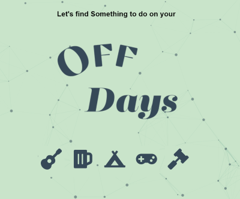

# Off Days!

## Description
Work in Progress

## Table of Contents

- [Description](#description)
- [Usage](#usage)
- [Active Site](#active_site)
- [Image](#image)
- [Questions](#questions)

## Description
This application is a MERN stack program using MongoDB, Express.js, React,js, and Node.js. Along with this I used Graphql and Apollo Server for routing and connecting the client and server side. The APIs I used are from NPS, SeatGeek, Open Brewery DB, and Free-to-game. All the design was made with my own CSS along with a few animations from react-reveal and Particles.js.

## Usage
I built this with everyone in mind. Everyone has days they wake up and realize their work week has consumed any time for plans for today, your off day! Is it nice outside? Check out parks and outdoor events. Not so nice? Well catch a show or just get your game on! Come give it a try and add any ideas you can on our forum!

## Active Site

[Off Days](https://morning-refuge-25381.herokuapp.com/)

## Image

## Questions
If you need any more information on using this application, my email is [simplererstone@gmail.com](simplererstone@gmail.com).  
My GitHub is - > [Simplerer](https://github.com/Simplerer) < -